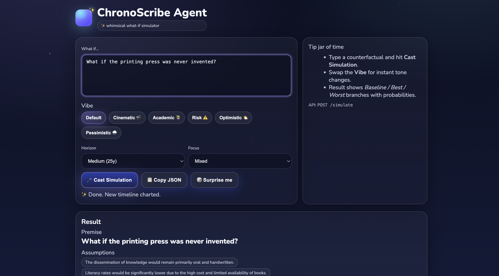
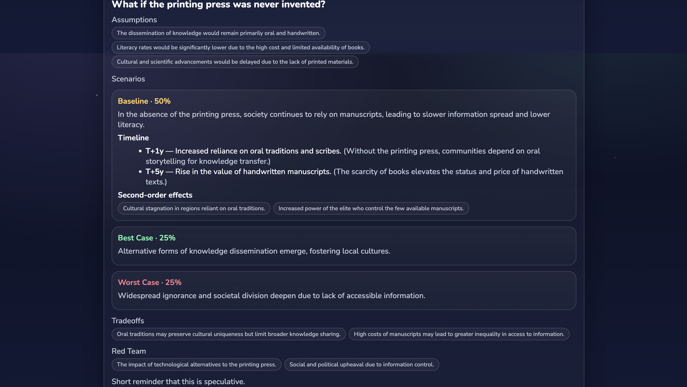

# 🕰️ ChronoScribe Agent — What-If Simulator

ChronoScribe is a tiny, agentic FastAPI app that explores alternate histories and futures.  
It produces **structured JSON** with **Baseline / Best / Worst** branches, timelines, and second-order effects — and ships with a whimsical one-file UI.






---
## ✨ Features

- **Agentic tools**: uses `wiki_summary` + `make_timeline_anchors` for grounded assumptions and consistent T+Ny labels  
- **Structured output**: clean JSON (probabilities, timeline events, rationale, tradeoffs, red-team)  
- **Simple UX**: one endpoint, one whimsical UI (`/`)  
- **Zero-DB, tiny stack**: FastAPI + OpenAI SDK, Dockerized

---

## 🧱 Tech Stack

- **API**: FastAPI + Uvicorn  
- **Model**: OpenAI (configurable model id)  
- **Agent**: `ChronoScribeAgent` (prompt + tool-calling loop + post-processing)  
- **UI**: single static HTML file served by FastAPI (no extra container)

---

## 📁 Project Structure

    chronoscribe-agent/
    ├─ app/
    │ ├─ main.py # FastAPI routes (/, /health, /simulate)
    │ ├─ agent.py # ChronoScribeAgent class + tools + loop
    │ ├─ schemas.py # Pydantic request models
    │ └─ static/
    │ └─ index.html # whimsical one-file UI
    ├─ Dockerfile
    ├─ docker-compose.yml
    ├─ requirements.txt
    ├─ .env.example
    └─ README.md
---

## 🚀 Quick Start

**Clone**
```bash
git clone <your-repo-url> chronoscribe-agent
cd chronoscribe-agent
```
**Set API Key**
```bash
cp .env.example .env
# edit .env and set: OPENAI_API_KEY=sk-...
```

**Run Docker**
```bash
docker compose up --build
# open the UI at http://localhost:9000
```

**⚙️ Configuration**

    - Set in .env:
    - OPENAI_API_KEY (required)
    - OPENAI_MODEL (default: gpt-4o-mini)
    - TOOLS_ENABLED (default: 1 — set to 0 to disable tool use)
    - CURRENT_YEAR (optional; pin for deterministic demos)


**✍️ About the Agent**

The agent lives in app/agent.py as ChronoScribeAgent — it defines the system policy, tool set, a function-calling loop to execute tools (Wikipedia summary, timeline anchors), and post-processing (probability renormalization / defaults). The API wraps it so /simulate accepts simple or advanced requests.
